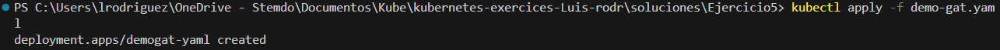
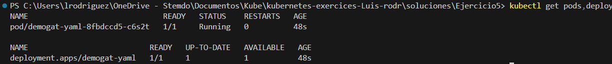

### 1. Crea un manifiesto de un DEPLOYMENT con las siguientes características:
- Nombre: demogat-yaml
- Imagen: tomcat:11.0.0-M20
- Nombre de contendor: tomcat
- Usaremos la etiqueta app:gato, para el match

### 2. Crea este de manera DECLARATIVA.
```bash
kubectl apply -f demo-gat.yaml
```


### 3, 4. Lista los POD y deploment
```bash
kubectl get pods,deploy
```


### 5. En este caso NO BORRAR EL DEPLOY, YA QUE SE USARÁ PARA EL PRÓXIMO EJERCICIO.