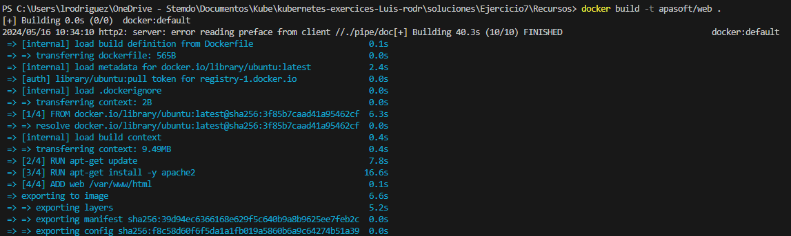
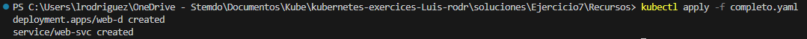
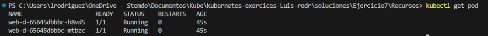
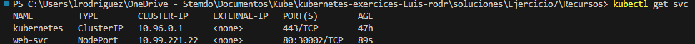
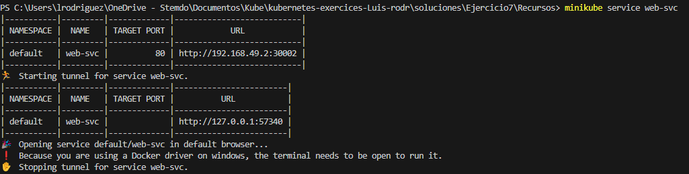
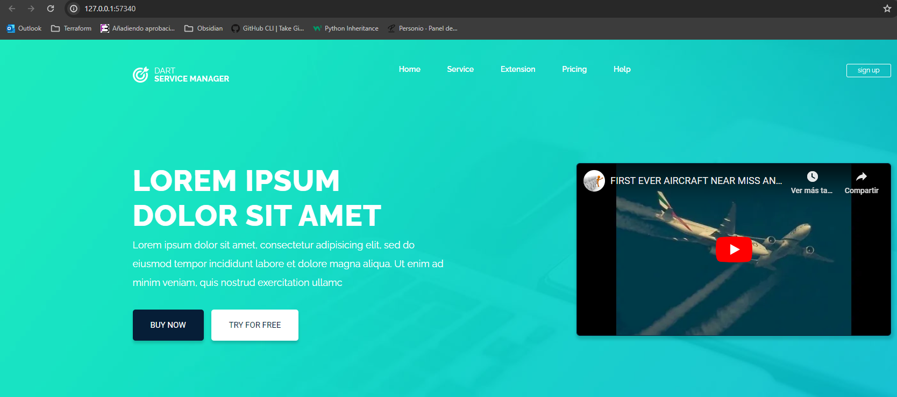
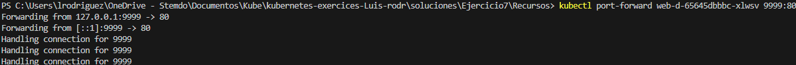
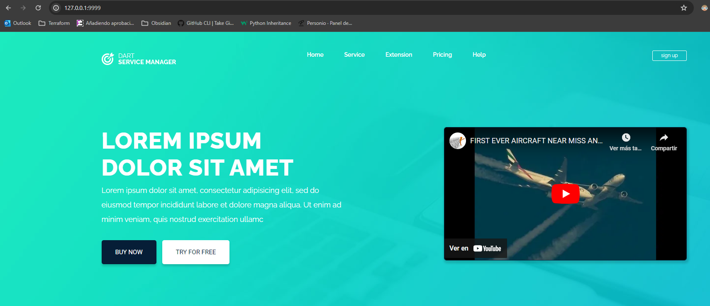

### 1. Ejercicio vídeo 89
#### Generar despliegue y servicio
`docker build -t apasoft/web`


`kubectl apply completo.yaml`


`kubectl get pod`


`kubectl get svc`


`minikube service web-svc`


Y podemos acceder a:



Alternativamente, modificando el tipo de servicio, por ejemplo, en `Recursos/completo.yaml` y removiendo las referencias al tipo nodeport, por lo cual ponemos el tipo cluster-ip por default.

```yaml
apiVersion: v1
kind: Service
metadata:
  name: web-svc
  labels:
     app: web ##Puede ser otra etiqueta
spec:
  ports:
  - port: 80
    #nodePort: 30002  #Normalmente es aleatorio
    protocol: TCP
  selector:
     app: web
```
Y ejecutando
`kubectl port-forward web-d-65645dbbbc-xlwsv 9999:80`

Podemos acceder a
