### 1. Creamos un manifiesto de un DEPLOYMENT con las siguientes características:

- Nombre: colors.
- images/imagen: noloknolo/colors.
    La uso con el tag v1 dado que latest me causa un error al intentar hacer pull, y para acostumbrarme a usar un tag concreto, que es buena práctica
- Nombre del contenedor: coloread.
- Usa la etiqueta que quieras para el match.
    Uso la etiqueta 'luis'
- 3 réplicas.
- Investigar cómo conseguir el puerto que usa la images/imagen y exponerlo.
- Despliega este de manera DECLARATIVA.

    ```console
    docker pull noloknolo/colors
    kubectl apply -f colors.yaml
    ```
    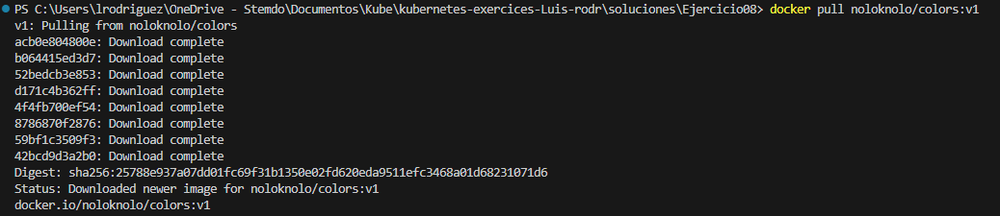
    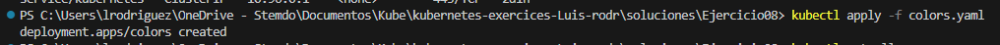

    Para especificar el puerto, puedo especificarlo en el yaml, en el contenedor, con: 
    ```yaml
    ...
    containers:
      - name: coloread
        images/image: noloknolo/colors:v1
        ports:
        - containerPort: 8080 #O cualquiera que quiera poner
          protocol: TCP
    ...
    ```
    Alternativamente puedo usar `kubectl describe pod` (sin parámetros adicionales para que describa todos, o con el nombre de cada pod). Sin haberlo especificado, lo colocará automáticamente.
    Podemos hacer una búsqueda más concreta con `kubectl get endpoints -o yaml`
    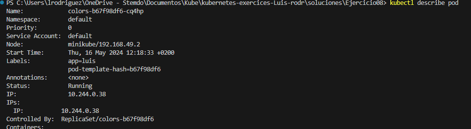
    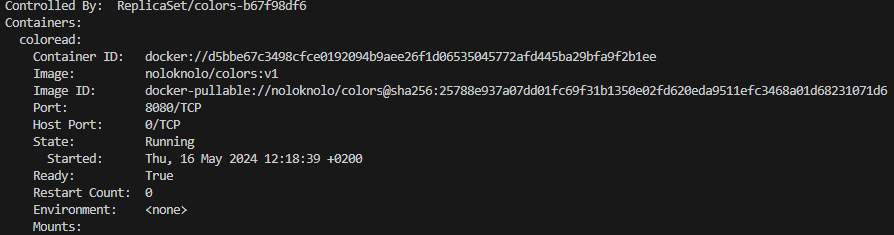
    Para exponerlo usaré `kubectl get pod` para obtener el nombre, lo anterior para saber el puerto, y `kubectl port-forward <nombre-pod> <puerto-local>:<puerto-remoto>`
    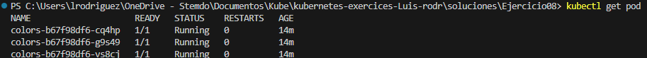

    `kubectl port-forward colors-b67f98df6-cq4hp 30001:8080`
    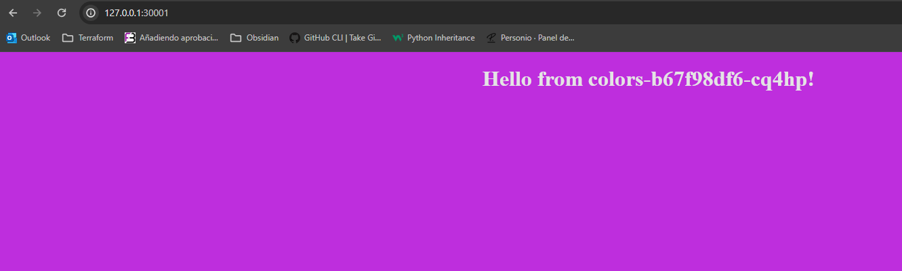
    `kubectl port-forward colors-b67f98df6-g9s49 30002:8080`
    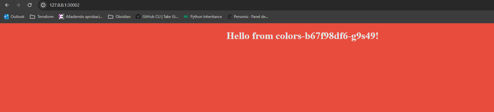
    `kubectl port-forward colors-b67f98df6-vs8cj 30003:8080`
    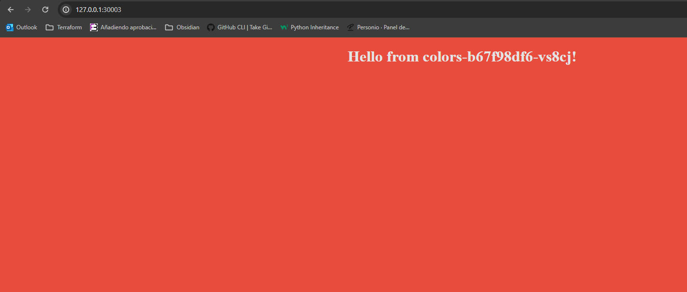

### 2. Crea un manifiesto SERVICE para el DEPLOYMENT anterior con las siguientes características:

Nombre: colors-service.
Tipo: ClusterIP.
Puerto: el puerto que has averiguado antes.
Muestra los comandos necesarios para documentar el proceso y que todo funcione correctamente.

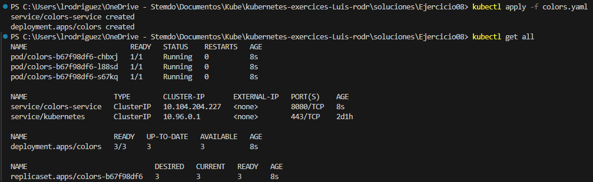
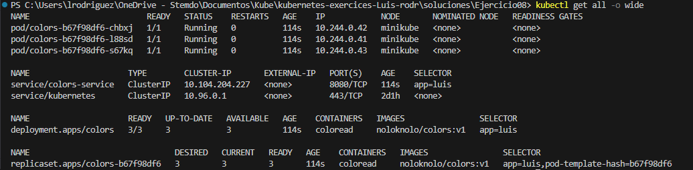
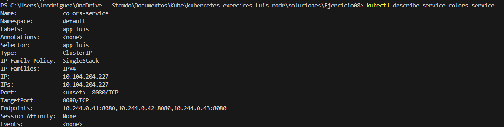

### 3. Conecta el servicio a un puerto local y muestra el resultado en un navegador.
Aunque en este caso concreto no funciona para el siguiente paso, el comando es `kubectl port-forward svc/colors-service 8081:8080`
Ahora mismo recibo el resultado: 
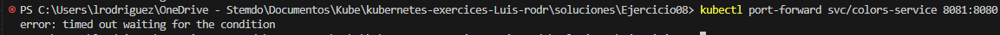

### 4. Recarga la página varias veces y registra lo que muestra el navegador (capturas).

Haciéndolo de la forma sugerida,  con `minikube service colors-service` obtengo
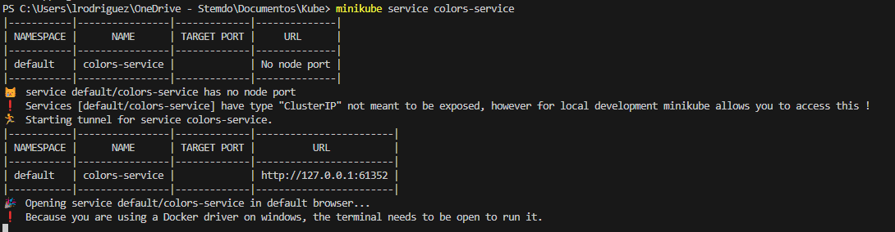
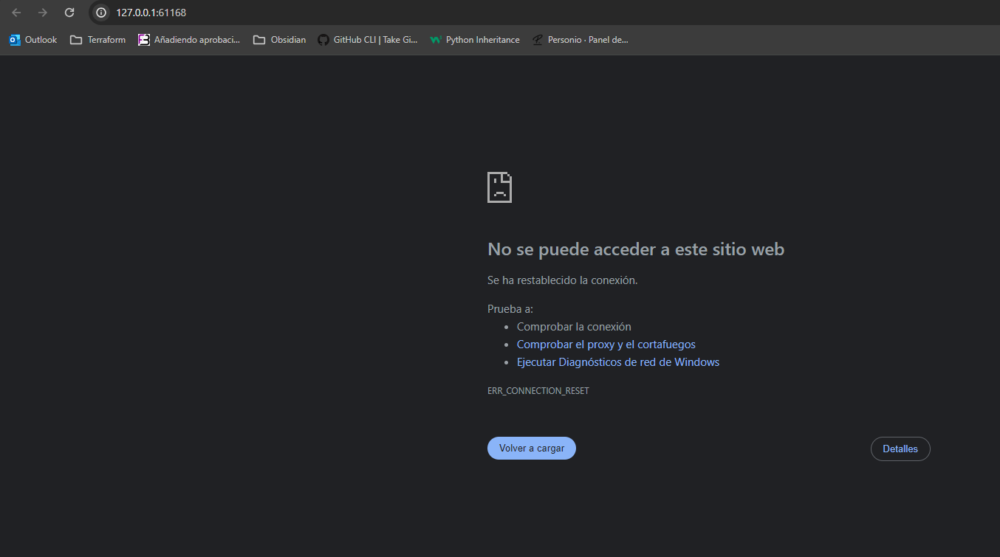
