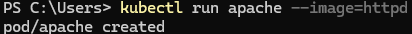
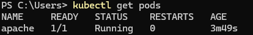
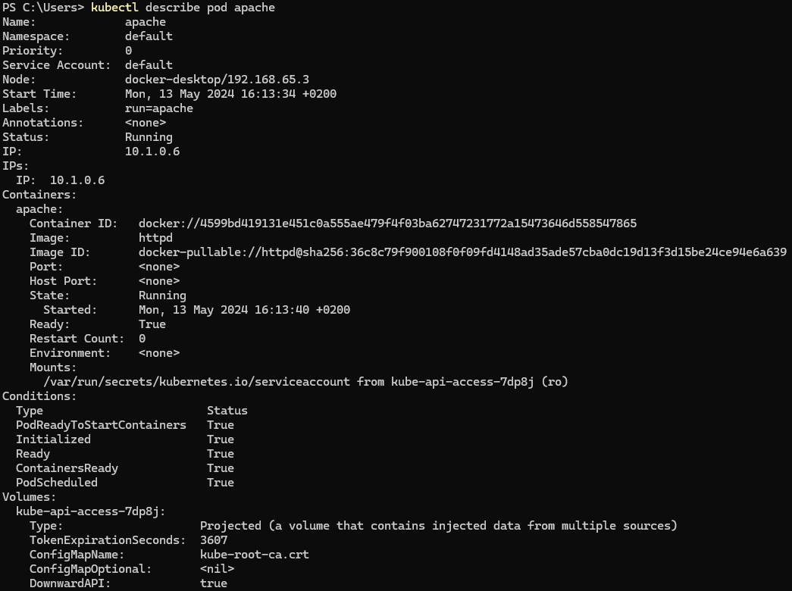
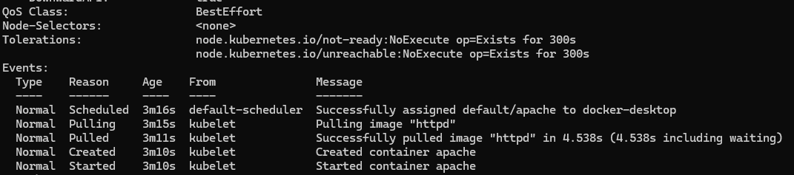
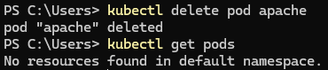

### 1. Crea un POD con las siguientes características:
   - Nombre "apache"
   - Imagen httpd
   - Hazlo de manera IMPERATIVA.

```
kubectl run apache --image=httpd
```


---

### 2. Lista los POD.
```
kubectl get pods
```


### 3. Describe el POD.
```
kubectl describe pod apache
```



### 4. Borra el POD.

```
kubectl delete pod apache
```
