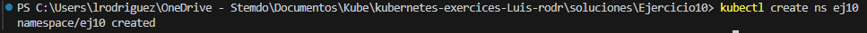
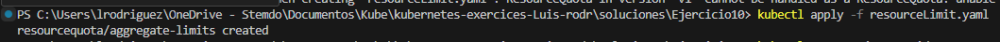
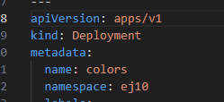
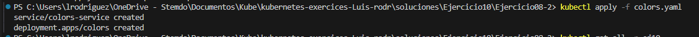
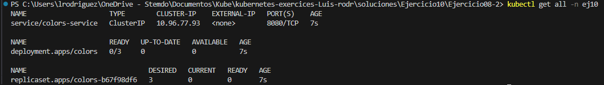
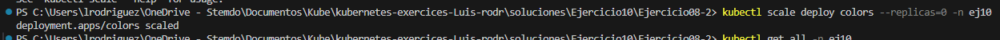
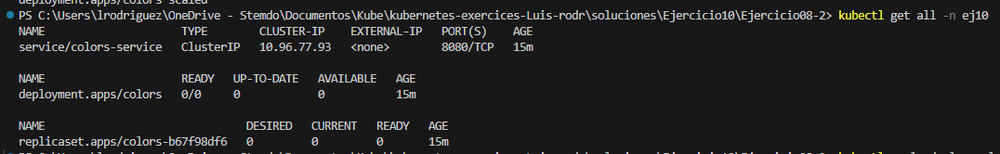

### Crea un namespace con el nombre que prefieras, de manera IMPERATIVA.
`kubectl create ns ej10 `

### Aplica limitaciones de recursos a este namespace, de manera DECLARATIVA, para que no pueda usar más de 1 CPU y 1GB de memoria y como mínimo 0.5 CPU y 0.5GB de memoria.
`kubectl apply -f resourceLimit.yaml`

### Despliega los elementos del ejercicio 8 en este namespace de manera DECLARATIVA (debes modificar sus manifiestos).
Esto se hace de forma declarativa, añadiendo una etiqueta relativa al `namespace` en el apartado `metadata`:

Y con el comando:

`kubectl apply -f colors.yaml`

### Lista todos los elementos del namespace para mostrar el resultado.
Añadimos al comando usual la etiqueta `-n <nombre-namespace>` o `--namespace <nombre-namespace>`
`kubectl get all -n ej10 `

### Haz lo necesario para que, sin borrar el deployment, no quede ningún POD levantado.

Esta vez se hará escalando el deployment a 0, especificando el namespace tras el deployment.

`kubectl scale deployment <nombre-deployment> --replicas=0 --namespace <nombre-namespace>`

O, alternativamente:

`kubectl scale deploy <nombre-deployment> --replicas=0 -n <nombre-namespace>`

En este caso, 

`kubectl scale deploy colors --replicas=0 -n ej10`

### Lista todos los elementos del namespace para mostrar el resultado.

`kubectl get all -n ej10 `

