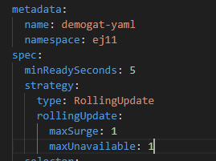
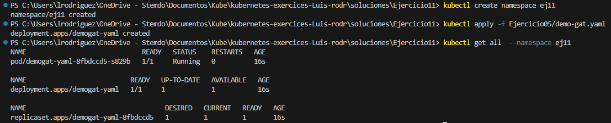
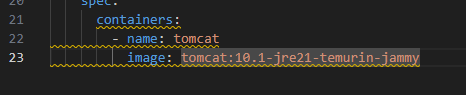
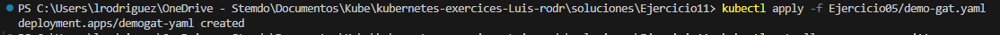
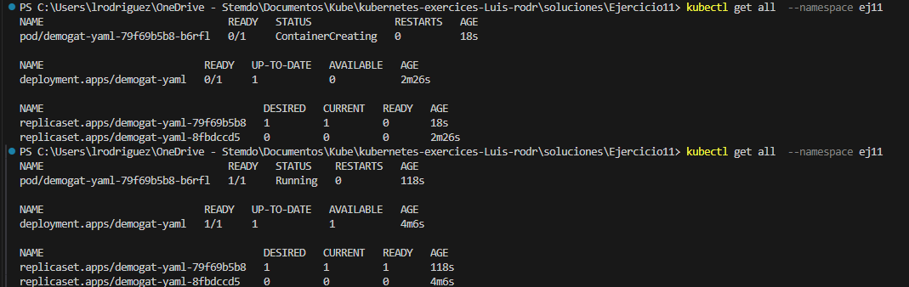
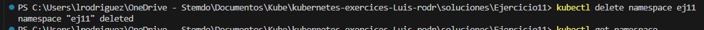
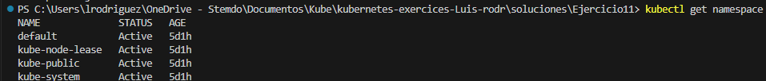
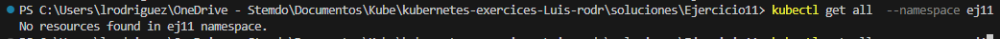

### 1. Crea un namespace con el nombre que prefieras.

`kubectl create namespace ej11`

### 2. Tomaremos el deployment del ejercicio 5 y lo modificaremos para que use la estrategia RollingUpdate.

Añado:

### 3. Despliega el deployment en el namespace creado.

`kubectl apply -f Ejercicio05/demo-gat.yaml`

### 4. Modifica el deployment para usar una tag diferente de la imagen.

Usaremos la imagen `tomcat:10.1-jre21-temurin-jammy`

### 5. Actualiza el deployment para que use la nueva imagen.

`kubectl apply -f Ejercicio05/demo-gat.yaml`

### 6. Explica el proceso de actualización de la imagen.

Sustituye los pods al ritmos especificado, creando otros  con nuvas IPs del cluster, y removiendo los viejos.

### 7. Limpia todos los recursos creados.

En lugar de borrar en orden, deployment, service y demás, en este caso opto por usar `kubectl delete namespace ej11`

