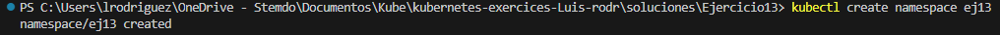
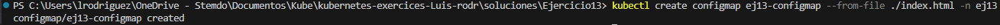
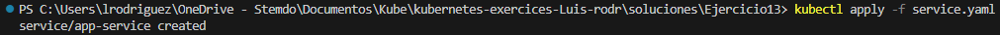
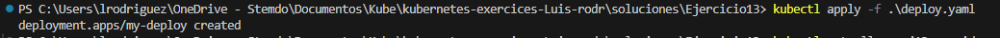
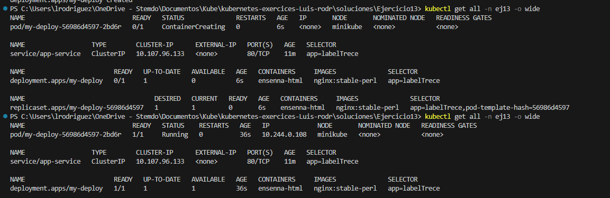
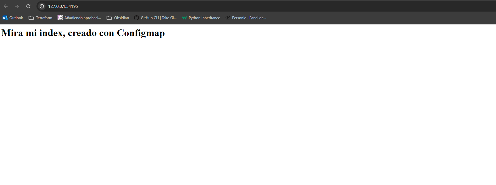

### Crear ConfigMap

Creo primero un namespace ara todo el 'proyecto'

`kubectl apply -f namespace.yaml`

Luego creo el configMap

`kubectl create configmap ej-13-configmap --from-file ./index.html -n ej13`

### Crea tanto un deployment como un service, que muestre el contenido del ConfigMap desde un navegador.

`kubectl apply -f service.yaml`

Uso una imagen de nginx

`kubectl apply -f deploy.yaml`

`kubectl get all -n ej13 -o wide`

`minikube service app-service -n ej13 `
