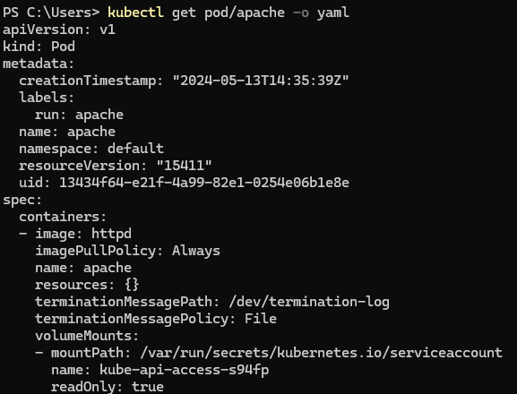
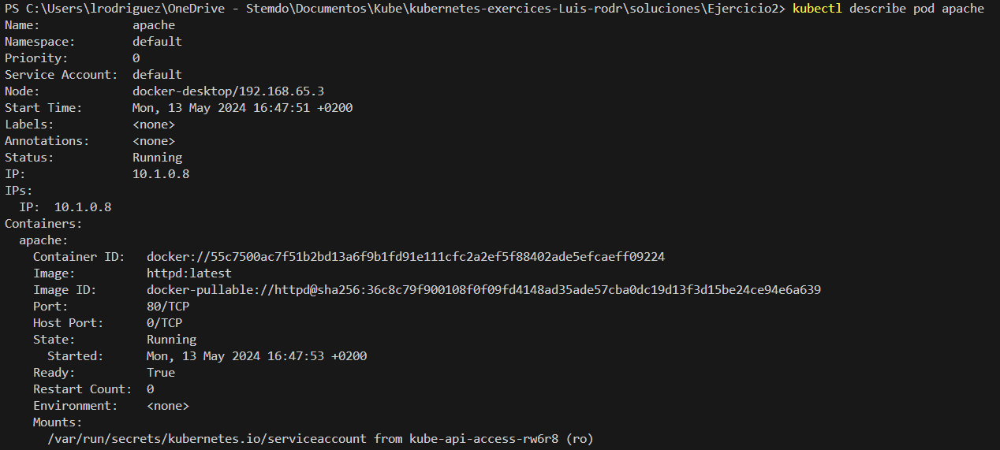

### 1. Crea un POD con las siguientes características:
   - Nombre "apache"
   - Imagen httpd
   - Despliégalo de manera IMPERATIVA.

Partiendo del ejercicio anterior, podemos ejecutar los mismo comando, acompañados de otro que nos trae un objeto yaml a partir del pod existente 
```
kubectl run apache --image=httpd
kubectl get pod/apache -o yaml > apache_pod_auto_gen.yaml ##Este solo en bash
```


O alternativamente, ya que el anterior devuelve un yaml con errores según Visual Studio Code, podemos usar el archivo apache_pod.yaml que podemos encontrar en este mismo fichero.


---

### 2. Lista los POD.
```
kubectl get pods
```


### 3. Describe el POD.
```
kubectl describe pod apache
```


### 4. Borra el POD.

```
kubectl delete pod apache
```
