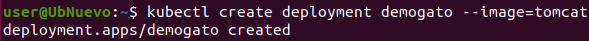
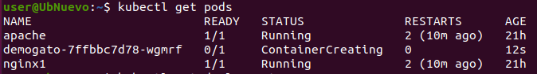
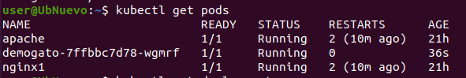
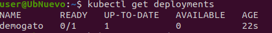
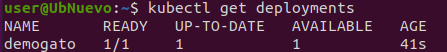
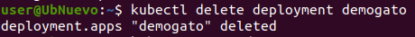
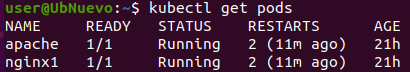

### 1. Crea un objeto DEPLOYMENT con las siguientes caracteristicas:
- Nombre: "demogato" 
- Imagen: tomcat
- Créalo de manera IMPERATIVA.

```
kubectl create deployment demogato --image=tomcat
```

---

### 2. Lista los POD.

```
kubectl get pods
```

 - Esperamos un poco a ue esté en Running
 


### 3. Lista los DEPLOYMENT.
```
kubectl get deployments
```

 - Esperamos un poco a ue esté en Ready


### 4. Borra el DEPLOYMENT.
```
kubectl delete deployment demogato
```



### 4. Lista los POD.
```
kubectl get pods
```
